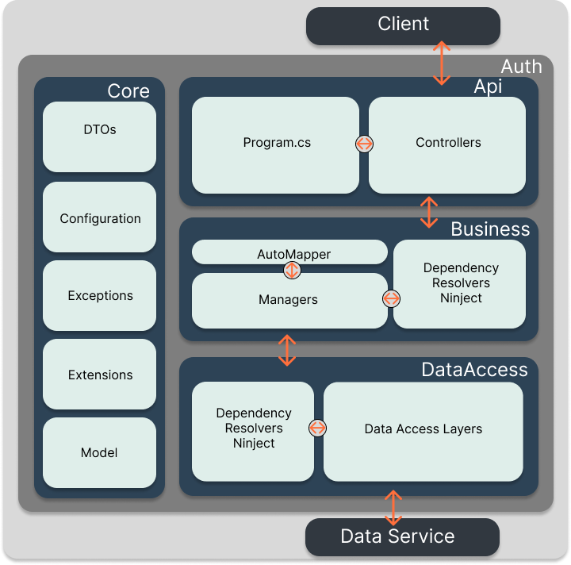

<hr>
<h6 align="center">
  <a href="https://docs.drawprogram.org">DrawCAD |</a>
  <a href="https://docs.drawprogram.org/doc">Doc |</a>
  <a href="https://docs.drawprogram.org/api">Api |</a>
  <a href="https://docs.drawprogram.org/geo">Geo |</a>
  <a href="https://docs.drawprogram.org/auth">Auth</a>
</h6>
<hr>

<div align="center">
    
</div>

Auth hizmeti authentication ve authorization işlemleri için token üretmek,token bilgilerini saklamak ve düzenlemek için tasarlanmıştır.Katmanlı mimari yapısındaki hizmet asp.net cor web api projesidir.Api,business,dataaccess ve core katmanlarından oluşmaktadır. Restapi türünde bir hizmettir.

<p>
    Projede;
    <div style="max-width:36rem;">
        <table>
            <tbody>
                <tr>
                    <td scope="row">Data Erişim :</td>
                    <td>Entity Framework Core</td>
                </tr>
                <tr>
                    <td scope="row">IOC Container : </td>
                    <td>Ninject</td>
                </tr>
                <tr>
                    <td scope="row">Validation : </td>
                    <td colspan="2">Fluent Validation</td>
                </tr>
                <tr>
                    <td scope="row">Map : </td>
                    <td colspan="2">AutoMapper</td>
                </tr>
                <tr>
                    <td scope="row">Kullanıcı İşlemleri : </td>
                    <td colspan="2">Identity</td>
                </tr>
            </tbody>
        </table>
    </div>
    teknolojileri kullanılmıştır.
</p>


<h3>Başlangıç</h3>
<p>Kullanmak için dockerhubtan imageyi indirebilir</p>

```
docker pull mzahidberber/drawauth:latest
```

<p>veya kaynak kodu indirip kendiniz image oluşturabilirsiniz</p>

```
docker build -t drawauth -f AuthServer.API/Dockerfile .
```

<p>Containeri başlatmandan önce veriler için mysql sunucuyu başlatmalısınız.</p>

```
docker run --name data -p 3306:3306 --env MYSQL_ROOT_PASSWORD:123456 --network=draw -v <your-path>:/var/lib/mysql  mysql
```

<p>Containeri başlatmandan önce veriler için mysql sunucuyu başlatmalısınız.</p>

```
docker run --name auth -p 5002:80 --env dbHost=data --env dbPort=3306 --env dbName=drawdb --env dbPassword=123456 --network=draw  drawauth
```